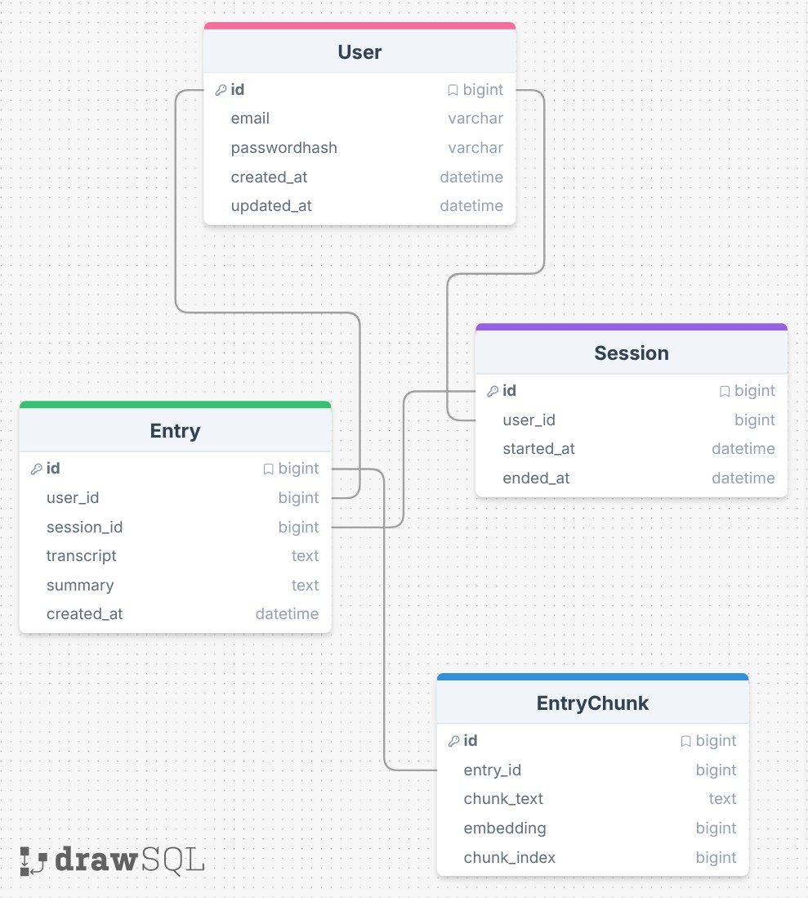

# Tanjent

AI speaking journaling assistant

## Summary

It's hard to find time to journal. It takes even longer to put the ideas on your head onto the page. Tanjent is an AI jounal assistant you talk to, and creates your journal entries with a simple discussion. Now you can journal as you cook dinner, do laundry, etc, no longer limited by your writing speed.

## System Design

Tech stack:

- Groq Whisper — speech to text
- GPT OSS 20B — AI brain
- Groq Orpheus — text to speech
- SQLite → Postgres — journal storage
- Python FastAPI for backend
- Typescript web app front end

## Database

