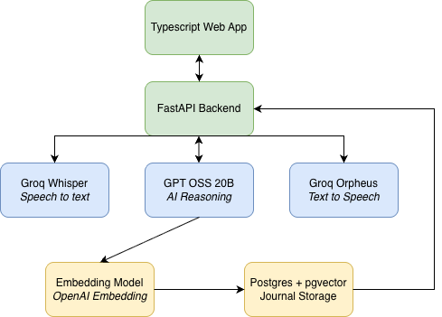

# Tanjent

AI speaking journaling assistant

## Summary

It's hard to find time to journal. It takes even longer to put the ideas on your head onto the page. Tanjent is an AI jounal assistant you talk to, and creates your journal entries with a simple discussion. Now you can journal as you cook dinner, do laundry, etc, no longer limited by your writing speed.

## System Design

Tech stack:

- Groq Whisper — speech to text
- GPT OSS 20B — AI brain
- Groq Orpheus — text to speech
- SQLite → Postgres — journal storage
- Python FastAPI for backend
- Typescript web app front end

## AI Integration

Tanjent chains three Groq-hosted models in a single HTTP request to create a full voice-in, voice-out conversational loop:

1. **Whisper Large V3 (STT)** - The user's audio recording is sent to Groq's Whisper endpoint, which returns a text transcript.
2. **GPT-OSS-20B (LLM)** - The transcript is appended to the full conversation history and sent to Groq's chat completions API. A system prompt instructs the model to act as a concise journaling companion: ask open-ended questions early, reflect patterns later, and keep replies to one or two spoken sentences.
3. **Orpheus V1 English (TTS)** - The LLM response is converted to a WAV audio clip via Groq's speech endpoint.

Completed sessions also generate a semantic embedding using OpenAI's `text-embedding-3-small` model. The embedding is stored as a pgvector column on the session and powers a cosine-distance semantic search endpoint, letting users find past journal entries by meaning rather than exact keywords.

## Learnings

- **TTS character limits** - Orpheus silently errors on inputs over 200 characters. Truncating to the last sentence boundary instead of hard-cutting mid-word produces more natural sounding output.
- **VAD in the browser** - Silero VAD's ONNX model and the ONNX Runtime WASM files can't be served from Vite's `public/` directory because Vite's transform pipeline breaks the `import()` that ONNX Runtime uses for WASM. A custom Vite middleware serves them directly from `node_modules`.
- **Embedding search** - Generating an embedding from the session summary + transcript at completion time enables semantic search that finds entries by concept, not just matching words.

## Interest

I wanted to experiment with the full pipeline of real-time voice AI, capturing audio in the browser, chaining STT/LLM/TTS models, managing conversation state, and streaming audio back to the user. Each piece has its own constraints, and getting them to work together smoothly was a problem I was interested in solving.

## Scaling, Performance & Authentication

**Performance** - The main bottleneck is the sequential STT to LLM to TTS chain, which adds up to a few seconds of latency per turn. Each Groq call is offloaded to a thread so the server can handle other requests concurrently, but the user still waits for all three to complete.

**Scaling** - The backend is a single FastAPI process. Horizontal scaling would require running multiple workers behind a load balancer. The base64-encoded audio response is the largest payload per request, switching to chunked streaming or a presigned URL would reduce memory pressure.

**Authentication** - Users register with email and password. Passwords are hashed with bcrypt and stored in Postgres. On login, the server issues a JWT. The frontend stores the token in `localStorage` and attaches it as a Bearer header on every API request. Every `/sessions/*` route verifies the token.
